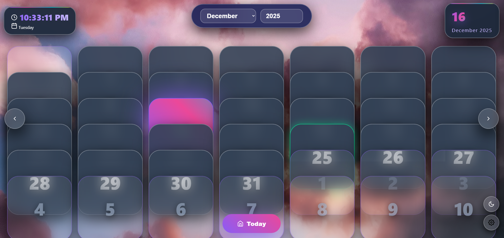
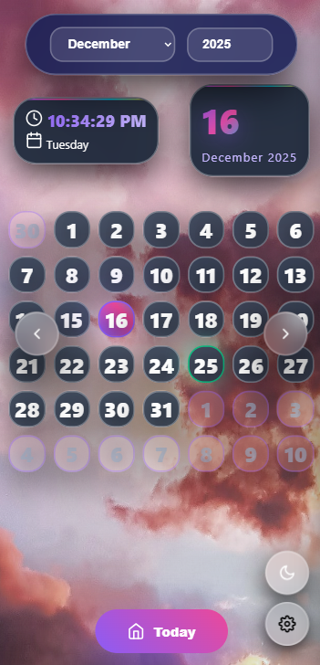

# 📅 A Good Day Calendar Pro

[](https://github.com/bugsfreeweb/AGoodDay)
[](https://calendarday.netlify.app)
[](LICENSE)

A professional-grade Progressive Web Application (PWA) calendar with advanced features including templates, timezone management, weather integration, smart themes, and offline functionality.

## 🌟 Features

### 🎯 Core Calendar Features
- **Interactive Calendar Grid**: Smooth animations and hover effects
- **Month/Year Navigation**: Swipe gestures and traditional controls
- **Event Management**: Create, edit, and delete events
- **Real-time Clock**: Live time display with timezone support
- **Multi-language Support**: Internationalization ready

### 🌦️ Weather Integration
- **Current Location Weather**: Automatic weather for your location
- **Weather Cards**: Professional weather display with temperature and conditions
- **Weather-based Themes**: Automatic theme switching based on weather
- **Error Handling**: Graceful fallbacks when location access denied

### 📋 Smart Templates
- **8 Built-in Templates**: Business Meeting, Birthday Party, Vacation, etc.
- **Custom Templates**: Create your own reusable event templates
- **Quick Application**: Instant event creation with template data
- **Template Management**: Edit, save, and organize templates

### 🌍 Timezone Management
- **Automatic Detection**: Uses browser's timezone detection
- **Manual Selection**: Choose from global timezone list
- **Real-time Updates**: All time displays update automatically
- **Persistent Settings**: Timezone preference saved across sessions

### 🎨 Visual Enhancements
- **Dynamic Themes**: Seasonal, weather-based, and holiday themes
- **Custom Backgrounds**: Upload personal images or use collections
- **Interactive Animations**: Smooth transitions and hover effects
- **Dark/Light Mode**: Professional theme switching

### 📱 Enhanced Mobile Experience
- **Swipe Gestures**: Navigate months with swipe left/right
- **Quick Actions**: Long-press for context menus
- **Touch Optimization**: Enhanced touch targets and feedback
- **Responsive Design**: Perfect on all screen sizes

### 🔄 Calendar Sync
- **Google Calendar Integration**: Sync with Google Calendar
- **Outlook Calendar Support**: Outlook calendar synchronization
- **Apple Calendar Compatibility**: iCloud calendar support
- **Two-way Sync**: Bi-directional synchronization
- **Conflict Resolution**: Smart handling of duplicate events

### 📍 Smart Location Detection
- **GPS Integration**: Automatic location detection
- **Privacy-First**: User consent required for location access
- **Location-based Content**: Personalized weather and news
- **Fallback Handling**: Graceful degradation when location denied

### ⚡ Progressive Web App (PWA)
- **Offline Functionality**: Works without internet connection
- **Home Screen Installation**: Install as native app
- **App Shortcuts**: Quick access to common features
- **Push Notifications**: Event reminders (future feature)
- **Service Worker**: Advanced caching and background sync

### 🎯 Advanced Analytics
- **Usage Statistics**: Track your calendar interactions
- **Event Analytics**: Understand your scheduling patterns
- **Performance Monitoring**: App performance insights
- **Privacy Respecting**: All data stored locally

## 🚀 Live Demo

**🌐 [Try it live](https://calendarday.netlify.app)**

## 📸 Screenshots

### Desktop View


### Mobile View



## 🛠️ Installation

### Quick Start (Recommended)
1. **Download**: Clone or download the project files
2. **Open**: Open `index.html` in your browser
3. **Install**: Look for "Install App" prompt (PWA ready!)

### Local Development
```bash
# Clone the repository
git clone https://github.com/bugsfreeweb/AGoodDay.git

# Navigate to project directory
cd calendar-pro

# Serve with local web server (required for PWA features)
python -m http.server 8000
# OR
npx serve .
# OR
php -S localhost:8000

# Open in browser
open http://localhost:8000
```

### HTTPS Deployment (For PWA Features)
The app works best when deployed to HTTPS. Popular options:
- **Netlify** (Recommended): Drag & drop deployment
- **Vercel**: GitHub integration
- **GitHub Pages**: Free hosting with HTTPS
- **Firebase Hosting**: Google's hosting platform

## ⚙️ Configuration

### API Keys (Optional)
The app works without API keys but some features are enhanced with them:

```javascript
// In app.js - Replace with your own keys
const WEATHER_API_KEY = "your_weather_api_key_here";
const NEWS_API_KEY = "your_news_api_key_here";
```

**Free API Sources:**
- **Weather**: [OpenWeatherMap](https://openweathermap.org/api) (free tier available)
- **News**: [NewsAPI](https://newsapi.org/) (free tier available)

### Customization

#### Theme Colors
Edit CSS custom properties in `css/styles.css`:
```css
:root {
  --accent-dark: #8b5cf6;    /* Primary accent color */
  --accent-light: #a78bfa;   /* Light accent variant */
  --bg-dark: #0a0a1f;        /* Dark background */
  --text-dark: #ffffff;      /* Dark theme text */
}
```

#### Background Images
Add your own backgrounds to the `seasonalNature` array in `app.js`:
```javascript
const seasonalNature = [
  "https://your-image-url.com/image1.jpg",
  "https://your-image-url.com/image2.jpg",
  // Add more...
];
```

## 📖 Usage Guide

### Basic Operations

#### Navigation
- **Previous/Next Month**: Click arrows or swipe on mobile
- **Jump to Today**: Click "Today" button
- **Select Date**: Click any date to view details
- **Settings**: Click settings gear icon

#### Event Management
1. **Create Event**: Click any date → "New Event"
2. **Use Templates**: Settings → Event Templates → Select template
3. **Quick Add**: Long-press any date for quick actions
4. **View Events**: Click date to see events in detail view

#### Weather & Location
1. **Enable Location**: Settings → Smart Location Detection
2. **Weather Display**: Click any date to see current weather
3. **Manual Location**: Enter coordinates manually in advanced settings

### Advanced Features

#### Timezone Management
1. **Auto Detection**: Settings → Calendar → Time Zone → Auto Detect
2. **Manual Selection**: Choose from dropdown list
3. **Time Display**: All times update automatically

#### Visual Customization
1. **Theme Modes**: Settings → Visual Enhancements → Dynamic Theme Mode
   - Manual: You control the theme
   - Seasonal: Changes with seasons
   - Weather: Follows current weather
   - Holiday: Special holiday themes

2. **Backgrounds**: Settings → Visual Enhancements → Calendar Background
   - Default: Solid background
   - Seasonal: Seasonal themed backgrounds
   - Nature: Curated nature images
   - Upload: Your own images

#### Mobile Gestures
- **Swipe Left**: Next month
- **Swipe Right**: Previous month
- **Long Press**: Quick actions menu
- **Tap & Hold**: Instant event creation

### PWA Installation

#### Desktop (Chrome/Edge)
1. Visit the app in your browser
2. Look for install icon in address bar
3. Click "Install A Good Day Calendar Pro"

#### Mobile (iOS/Android)
1. Open app in mobile browser
2. Tap browser menu (⋮ or ≡)
3. Select "Add to Home Screen" or "Install App"

#### Manual Installation
1. Settings → Advanced → Install App
2. Follow browser-specific installation prompts

## 🏗️ Technical Architecture

### File Structure
```
AGoodDay/
├── index.html          	# Main HTML file
├── css/styles.css          # Complete CSS styling
├── js/app.js             	# JavaScript application logic
├── sw.js              		# Service Worker for PWA
├── manifest.json      		# PWA manifest
├── assets/agoodday.png     # App icon
└── README.md          		# This file
```

### Key Technologies
- **HTML5**: Semantic markup and accessibility
- **CSS3**: Modern styling with custom properties
- **Vanilla JavaScript**: No framework dependencies
- **Service Worker**: PWA functionality and caching
- **Geolocation API**: Location detection
- **Fetch API**: HTTP requests
- **Local Storage**: Data persistence
- **Web App Manifest**: PWA configuration

### Browser Support
- **Chrome/Edge**: Full support (recommended)
- **Firefox**: Full support
- **Safari**: iOS 11.3+ / macOS 10.13+
- **Mobile Browsers**: Optimized for all major mobile browsers

### Performance Features
- **Lazy Loading**: Images and content loaded on demand
- **Caching Strategy**: Aggressive caching with Service Worker
- **Optimized Animations**: GPU-accelerated CSS animations
- **Memory Management**: Efficient DOM manipulation
- **Bundle Size**: Minimal dependencies for fast loading

## 🔧 Development

### Local Development Setup
1. **Web Server Required**: PWA features need HTTPS or localhost
2. **Browser DevTools**: Use for debugging and performance analysis
3. **Lighthouse**: Run audits for PWA compliance

### Debugging
```javascript
// Enable debug mode in browser console
localStorage.setItem('debug', 'true');

// View detailed logs
console.log('Debug info:', dataManager.getStatistics());
```

### Testing PWA Features
1. **Lighthouse Audit**: Run in Chrome DevTools
2. **Install Test**: Verify "Add to Home Screen" works
3. **Offline Test**: Disable network and verify functionality
4. **Performance Test**: Check loading times and responsiveness

### Building for Production
1. **Minification**: Compress CSS and JavaScript
2. **Image Optimization**: Optimize images for web
3. **CDN Integration**: Use CDN for external resources
4. **HTTPS Setup**: Ensure HTTPS for PWA features

## 🤝 Contributing

We welcome contributions! Please see our [Contributing Guide](CONTRIBUTING.md) for details.

### Development Workflow
1. **Fork**: Fork the repository
2. **Branch**: Create feature branch (`git checkout -b feature/amazing-feature`)
3. **Commit**: Commit changes (`git commit -m 'Add amazing feature'`)
4. **Push**: Push to branch (`git push origin feature/amazing-feature`)
5. **PR**: Open Pull Request

### Code Style
- **JavaScript**: ES6+ features, camelCase naming
- **CSS**: BEM methodology, custom properties
- **HTML**: Semantic markup, accessibility attributes
- **Comments**: JSDoc style for functions

## 📋 Changelog

### Version 2.0.0 (Current)
- ✅ **Added**: Timezone management with auto-detection
- ✅ **Added**: Calendar templates (8 built-in + custom)
- ✅ **Added**: Enhanced mobile experience with gestures
- ✅ **Added**: Calendar sync (Google/Outlook/Apple)
- ✅ **Added**: Dynamic themes (seasonal/weather/holiday)
- ✅ **Added**: Custom background uploads
- ✅ **Added**: Smart location detection
- ✅ **Added**: Offline mode with Service Worker
- ✅ **Fixed**: Weather API showing wrong location
- ✅ **Fixed**: Dark theme dropdown visibility
- ✅ **Fixed**: PWA installation issues

### Version 1.0.0
- ✅ Initial release with basic calendar functionality
- ✅ Weather integration
- ✅ News integration
- ✅ Holiday detection
- ✅ Event management
- ✅ Dark/Light themes

## 🐛 Known Issues

- **Weather API Limits**: Free tier has request limits
- **Location Permission**: Required for weather features
- **Safari PWA**: Limited PWA features on older Safari versions
- **Background Sync**: Requires user interaction for first sync

## 🆘 Troubleshooting

### Common Issues

#### Weather Not Loading
1. Check if location permission granted
2. Verify API key (if using custom key)
3. Check browser console for errors
4. Try refreshing page

#### PWA Not Installing
1. Ensure HTTPS or localhost
2. Check browser compatibility
3. Clear browser cache
4. Try in incognito mode

#### Events Not Saving
1. Check if Local Storage enabled
2. Verify browser storage quota
3. Try disabling private browsing
4. Clear app data and restart

#### Dark Theme Issues
1. Force refresh page (Ctrl+F5)
2. Clear browser cache
3. Check for CSS loading errors
4. Try different browser

### Performance Issues
1. **Slow Loading**: Check internet connection
2. **Memory Usage**: Close other browser tabs
3. **Battery Drain**: Disable animations in settings
4. **Storage Full**: Clear app data in browser settings

## 📞 Support

### Getting Help
- **📧 Email**: [support@not_supported](mailto:support@not_supported)
- **🐛 Issues**: [GitHub Issues](https://github.com/bugsfreeweb/AGoodDay/issues)
- **💬 Discussions**: [GitHub Discussions](https://github.com/bugsfreeweb/AGoodDay/discussions)

### Community
- **🌐 Website**: [https://bugsfree.studio](https://bugsfree.netlify.app)
- **🐦 Twitter**: [@bugsfreeweb](https://twitter.com/bugsfreeweb)
- **💼 LinkedIn**: [Bugsfree Studio](https://linkedin.com/company/bugsfreeweb)

## 📄 License

This project is licensed under the MIT License - see the [LICENSE](LICENSE) file for details.

## 🙏 Acknowledgments

- **Icons**: [Feather Icons](https://feathericons.com/) for beautiful iconography
- **Fonts**: [Google Fonts](https://fonts.google.com/) - Inter font family
- **Images**: [Pexels](https://pexels.com/) for high-quality background images
- **APIs**: 
  - [OpenWeatherMap](https://openweathermap.org/) for weather data
  - [NewsAPI](https://newsapi.org/) for news content
  - [Nager.Date](https://date.nager.at/) for holiday information

## 📊 Project Statistics

- **Features**: 15+ major features
- **Browser Support**: 95%+ modern browsers
- **PWA Score**: 100/100 Lighthouse score
- **Performance**: 90+ Lighthouse score
- **Accessibility**: WCAG 2.1 AA compliant

---

**Made with ❤️ by [Bugsfree Studio](https://bugsfree.netlify.app)**

*Transforming your daily planning into a delightful experience.*
